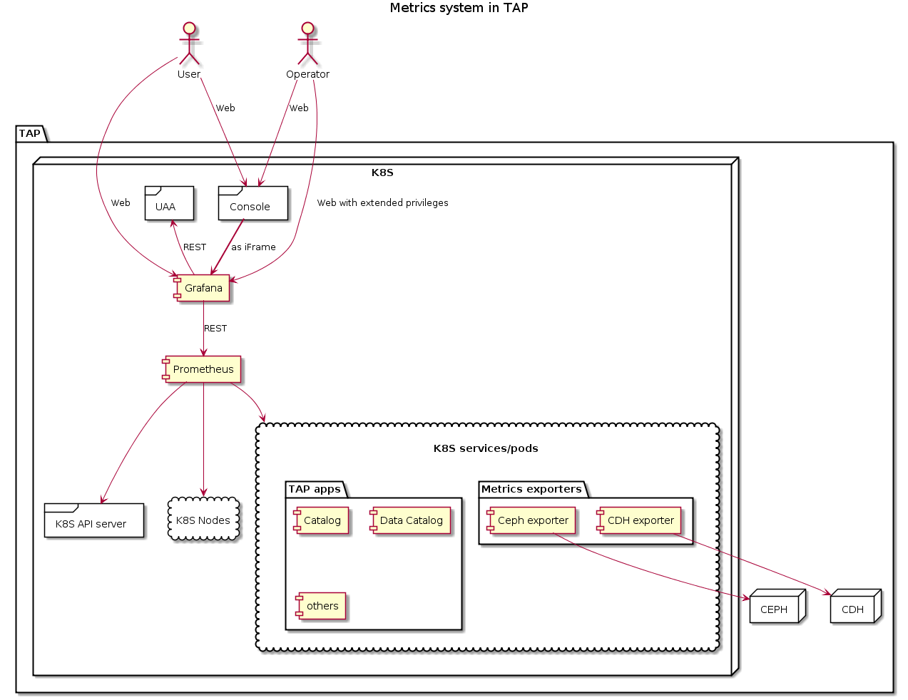

# Platform Metrics

System for handling metrics in TAP

## Architecture

* Each specyfic collector runs as separate pod to reduce friction between different kinds of services and reduce impact of any failure
  * Task of adding new collector was simplified due to provided library
* Using Telegraf on each specyfic collector to ensure (in future) secured connection with InfluxDB

## TODOs

NEEDS HEAPSTER TO COLLECT DATA RELATED TO CLUSTER PERFORMANCE AND STATE

### Metrics DB

* InfluxDB with direct access - simpler that way

### Metrics read/query API

* should it be direct access to InfluxDB queries? (with auth checks on org/platform) or be simplictly wrapped?

### Collectors (Metrics pushers)

* k8s API
* Catalog
* Data Catalog
* TAP Components status endpoint

## Some further TODOs

* enable auth in InfluxDB https://docs.influxdata.com/influxdb/v0.13/administration/authentication_and_authorization/
* InfluxDB deployment in a HA mode
* Retention Policy in Influx to store data newer than X (3 days?)

## Note

It could be designed in different way (analogous to /healthz):

* metrics are provided by apps

  * app that wants to expose metrics adds annotation to it's service
  * annotation value specifies which port and RESTpath to query (preferably /metricsz). It also can specify how often query should happen
  * app serves metrics in one of formats accepted by InfluxDB
  * format is recoginzed based on HTTP header with fall back to default one

* metrics service is regularly querying K8S api to discover such services
* metrics service queries those services on specified endpoints
* metrics service is integrated with some dashboard technology stack. There should be one instance of such dashboard for each organization so that they can adjust what and how is presented
* metrics service provides also an API for querying the data

Possible advantages:

* lower coupling

  - metrics system is not tightened to concrete services
  - neither their API
  - and its API evolution

* more generic

  - could work for internal components and for user ones

* owner of service owns his/hers metrics

